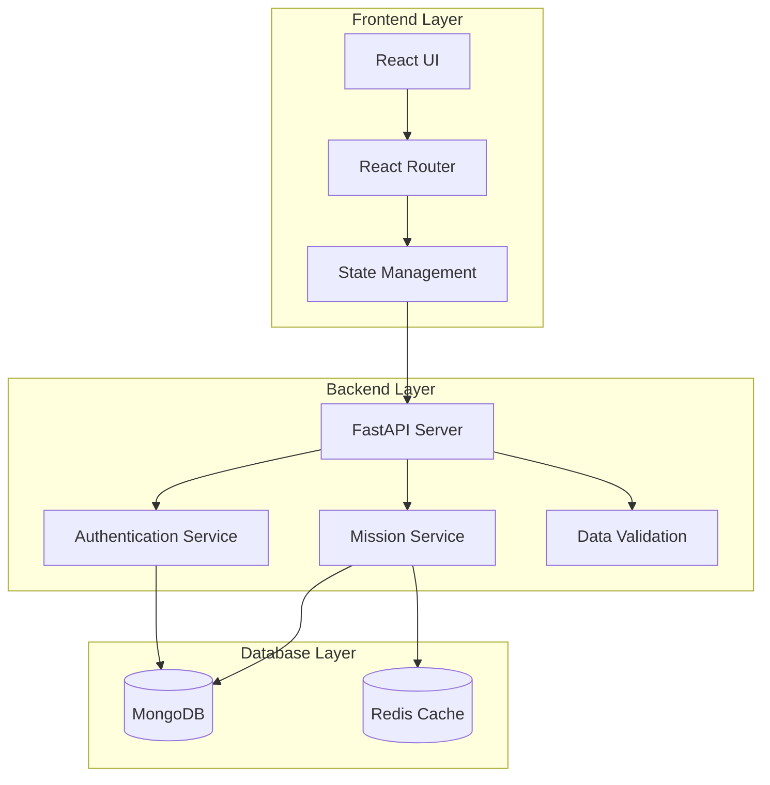
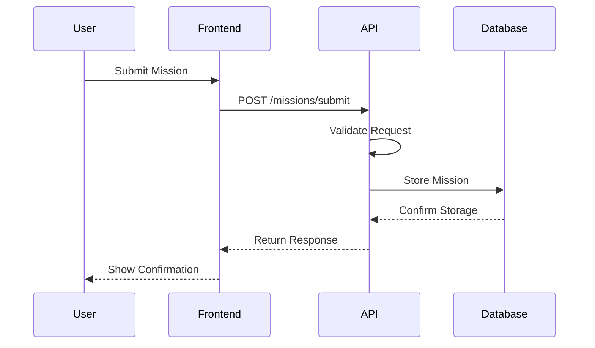
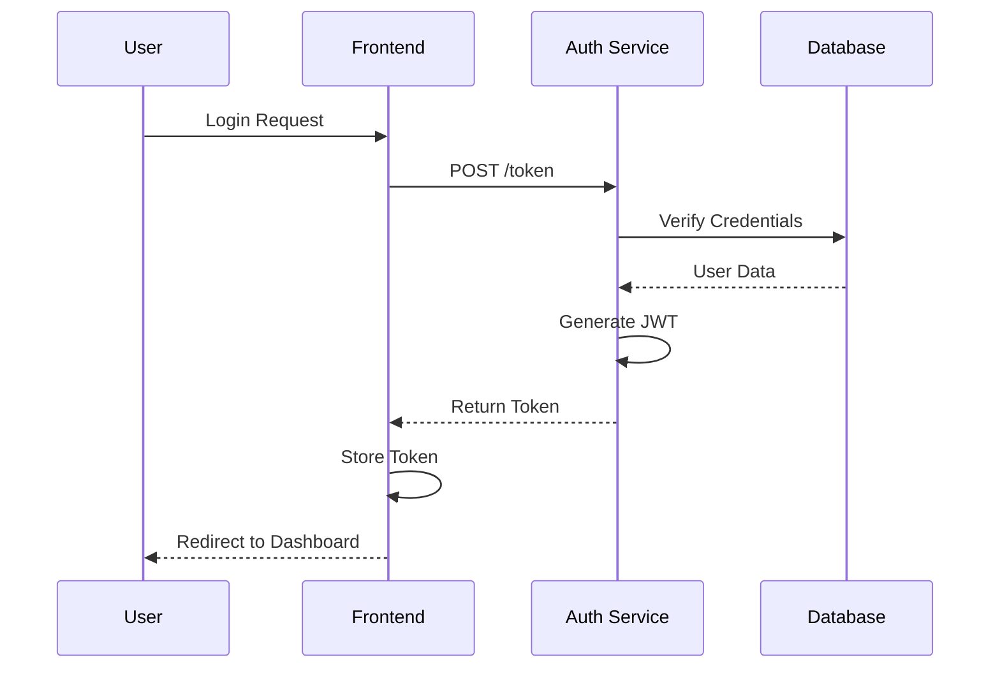

# Architecture Documentation

## System Overview

The S.H.I.E.L.D. Operations Request Portal is built using a modern microservices architecture, separating the frontend and backend concerns while maintaining a clear and secure communication channel between them.

## Architecture Diagram

## Component Details

### Frontend Components

1. **User Interface (React)**
   - Material-UI components
   - Responsive design
   - Form validation
   - Error handling

2. **Routing (React Router)**
   - Protected routes
   - Route-based code splitting
   - Navigation guards

3. **State Management**
   - Local component state
   - Context API for global state
   - JWT token management

### Backend Services

1. **API Layer (FastAPI)**
   - RESTful endpoints
   - OpenAPI documentation
   - Request/Response validation
   - Error handling middleware

2. **Authentication Service**
   - JWT token generation/validation
   - Password hashing (bcrypt)
   - Role-based access control
   - Session management

3. **Mission Service**
   - CRUD operations
   - Business logic
   - Data validation
   - Event logging

### Database Layer

1. **MongoDB**
   - Document-based storage
   - Collections:
     - users
     - missions
     - audit_logs
   - Indexes for performance

2. **Caching (Redis)**
   - Mission type caching
   - User session caching
   - API response caching

## Data Flow

### Mission Request Flow

1. User submits mission request:

### Authentication Flow

1. User login process:

## Security Architecture

### Authentication
- JWT-based token system
- Secure password hashing
- Token expiration and refresh
- HTTPS enforcement

### Authorization
- Role-based access control
- Resource-level permissions
- API endpoint protection
- Input validation

### Data Security
- Encrypted communication
- Secure password storage
- Data sanitization
- XSS protection

## Performance Considerations

### Caching Strategy
1. **API Response Caching**
   - Cache frequently accessed data
   - Cache invalidation rules
   - Cache hit ratio monitoring

2. **Database Optimization**
   - Indexed queries
   - Query optimization
   - Connection pooling

### Scalability
1. **Horizontal Scaling**
   - Stateless API design
   - Load balancer ready
   - Database sharding support

2. **Vertical Scaling**
   - Resource optimization
   - Memory management
   - CPU utilization

## Monitoring and Logging

### System Monitoring
- API endpoint metrics
- Database performance
- Error rates
- Response times

### Logging
- Application logs
- Access logs
- Error logs
- Audit trails

## Deployment Architecture

### Development
- Local development environment
- Hot reloading
- Debug configuration
- Test data

### Production
- Load balancer
- Multiple API instances
- Production database
- Monitoring systems

## Future Considerations

1. **Scalability Improvements**
   - Microservices split
   - Container orchestration
   - Message queues

2. **Feature Additions**
   - Real-time updates
   - File attachments
   - Advanced analytics
   - Mobile support

3. **Security Enhancements**
   - 2FA implementation
   - API rate limiting
   - Advanced audit logging
   - Automated security testing 